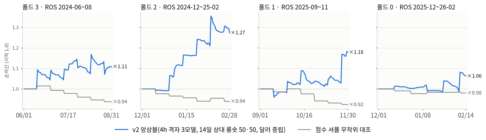

# HYFE_QTPA — 연구 파이프라인 확정안

차트 이미지·거래 밀도 인식 기반 암호화폐 급등·급락 조기 예측.
확정일 2026-09-02 · 중간발표 10/8(목) · 최종발표 11/9(월) · 회합 매주 월·목.

팀원 과제는 `A/` `B/` `C/` 폴더의 README와 `과제배부서.docx`, 논문은 `papers/`,
데이터는 `data/`에 있다. 실험 전 과정과 표는 `실험일지.md`, 설계 근거는 `실험설계_파인튜닝.md`.

## 0. 결과 (2026-09-08)

캔들 차트를 그리면 CNN 은 알파를 못 찾고, 거래 밀도·횡단면 순위·창 요약을 그린 차트를 주면
CNN 이 교사 없이 GBM 보다 나은 알파를 스스로 찾는다. 이 연구의 답은 "CNN 을 위한 차트 이미지 설계"다.

**이미지 CNN(교사 없음, 소형 CNN 75만 파라미터, 4h·60봉·14일 상대부호 라벨, 시드 3개 앙상블)**
— 코호트 롱숏(매 4h 마감에 상·하위 10% 를 14일 보유, 달러 중립, 왕복 0.2%, 단순수익), 폴드별 유동성 상위 200:

| 검증 구간 | Sharpe | p (Newey-West) | MDD | 순자산 | GBM 같은 구간 | 점수 셔플 |
|------|------|------|------|------|------|------|
| 2024-06~08 | 5.02 | 0.019 | −2.4% | ×1.10 | 4.48 | −4.8 |
| 2024-12~2025-02 | 4.04 | 0.012 | −3.9% | ×1.14 | 2.68 | −4.0 |
| 2025-09~11 | 2.93 | 0.011 | −3.9% | ×1.16 | 1.54 | −0.2 |
| 2025-12~2026-02 | 1.45 | 0.20 | −4.1% | ×1.04 | 1.22 | 0.3 |
| 합산 408일 | **3.01** | **0.0001** | −4.1% | ×1.52 | 2.18 | |
| 홀드아웃 2026-03~08 (첫 사용) | 2.24 | 0.016 | −9.8% | ×1.23 | 0.35~0.98 | −2.8 / −0.6 |

시드 하나만 써도 합산 2.29~2.92. 이미지(`heatf`, 96×180 그레이스케일) = 창 안 OHLC 로그비·거래량·30일 대비
거래량·시각·요일 8행 + 같은 시각 유니버스 안 순위 3행 + 창 끝 피처 37행. 렌더는 `hyfe/train_cnn.py`
(`--render heatf`), 학습은 `hyfe/fulldir.sh`, 판정은 `hyfe/cohort.py`·`hyfe/perf.py`, 실전 추론은 `hyfe/live_cnn.py`.

**기각된 원 가설**: 거래량 + 캔들 차트 이미지만으로 방향 예측 — 격자 1d·4h·1h, 창 20·60·120, 채널 5종,
거래량 유무, 추세 제거, 픽셀·높이, 종목 100~400, 학습률, 사전학습 ResNet 파인튜닝 등 22설정 전부 상대방향
spread_z ≤ 0. 이미지 점수는 모멘텀과 왜도를 골랐고 크립토 20일 모멘텀의 부호는 분기마다 뒤집혔다.

**같이 확인된 것**: 급등·급락 발생 예측은 5채널(차트+밀도+30일 거래량+시각+요일)이 흑백보다 전수 740종목
4폴드 중 3폴드 우위(H1 채택), 발생 예측에서 이미지 단독은 GBM 아래(H2 기각), 이미지 스태킹 순기여는 2025 에만
유의(H3 체제 의존). 구조화 GBM 상대방향 전략(v1+v2 혼합)은 24개월 연속 walk-forward Sharpe 2.39(p 0.0016).
BTC 매크로 피처·평면은 두 표현 모두에서 해로움. 유니버스를 현재 유동성으로 거르면 생존편향으로 spread_z 가
3배 부풀어 판단 시점 유동성으로만 걸렀다.

## 1. 파이프라인 전체 흐름

여덟 단계로 간다. 앞 네 단계가 예측기를 만들고 뒤 네 단계가 그것을 트레이딩 머신으로
바꾼다. P3 게이트를 통과해야만 본 학습에 들어가고, P7 통과 기준을 넘은 전략만 실전
후보가 된다.

| 단계 | 기간 | 하는 일 | 산출물·판정 |
|------|------|---------|-------------|
| P0 | 9/2~9/13 | CryptoBars 1분봉 정본 확정: 커버리지 감사, 제외 목록(토큰화 주식·원자재, bybit 자체집계 145종), 중복 제거. 상장폐지 코인은 유지(생존편향 제거). 심볼을 학습용/미학습 검증용으로 분리 | 정본 데이터셋, 감사표·제외 목록 |
| P1 | 9/7~9/20 | 라벨: 3클래스(급등·급락·평상), 판정 지평 H=60분. 기본형은 변동성 스케일 k·σ, 고정 ±p%는 비교용 | 라벨 엔진, 이벤트 통계 |
| P2 | 9/7~9/20 | 입력: 캔들+거래량 그레이스케일 이미지(기본 윈도 240분), 학습 중 GPU 즉석 렌더. 거래 밀도 피처(상위 5분 거래 집중도 등) 병행 산출 | 렌더러, 밀도 피처 셋 |
| P3 | 9/14~9/20 | 소표본 파일럿 학습 후 계속 여부 판정. 게이트 ① 기준선(GBM)을 신뢰구간 밖에서 초과 ② 라벨을 섞으면 성능이 무너져야 함 ③ 학습·평가 기간을 바꿔도 우위 유지 | go / no-go 판정 |
| P4 | 9/21~10/4 | 라운드 1: 시간 해상도(1분·5분·15분·1시간·일봉) × 입력 윈도 비교. 라운드 2: 라벨 변형·백본(소형 CNN vs ImageNet 파인튜닝)·밀도 융합 유무. 평가는 PR-AUC 주지표, walk-forward, 미학습 심볼 홀드아웃 | 라운드별 결과표, 후보 모델 2~3개 |
| P5 | 10/5~10/8 | 최종 모델 선정·동결, 중간발표(팀장) | 동결 모델, 중간발표 10/8 |
| P6 | 10/12~10/25 | 전략 변환: 메타라벨링, 트리플 배리어 청산, 분수 켈리(1/4 이하)+킬스위치. 체결 규약: 신호 후 1봉 지연, 다음 봉 시가 체결, 슬리피지 반영. 순서는 S4 리스크 오버레이 먼저, S2 소진 페이드 숏 다음 | 비용 반영 백테스트 결과 |
| P7 | 10/26~11/8 | 실시간 페이퍼 트레이딩 가동, 시연 데모 제작. 통과 기준: 순샤프 2 이상, MDD 15% 이하, 페이퍼 vs 백테스트 괴리 30% 이하 | 데모·실측 로그, 최종발표 11/9 |

## 2. 지금 확정하는 것

| 항목 | 확정 | 이유 |
|------|------|------|
| 대상 데이터 | CryptoBars 1분봉 전체, 상폐 포함, 제외 목록 적용 | 생존편향 없는 3.5년 8.3억 행이 이 연구의 최대 무기 |
| 라벨 기본형 | k·σ 변동성 스케일, H=60분 | 코인별 변동성 차이를 흡수한다. 고정 ±p%는 비교 실험으로만 |
| 기본 이미지 | 240분 캔들+거래량 그레이스케일 | 검증된 JKX 계열 표현. 변형은 라운드가 판정 |
| 주지표 | PR-AUC | 급등락은 희소 클래스라 정확도·ROC보다 적합 |
| 검증 방식 | walk-forward + 미학습 심볼 홀드아웃 | 시간 누수와 종목 암기를 둘 다 차단 |
| 승자 규칙 | 미학습 심볼 PR-AUC 우선, 동률이면 더 단순한 모델 | 과적합 방지 |
| 전략 순서 | S4(방어)부터, S2(주력) 다음 | S4는 예측이 약해도 잃을 게 없는 구조 |
| 발표 | 팀장 전담(대본·슬라이드 최종·발표) | 메시지 일관성 |

## 3. 실험이 정하는 것

아래 다섯 가지는 지금 정하지 않는다. 라운드 결과가 정한다.

- 최적 시간 해상도와 입력 윈도 길이 (라운드 1)
- 라벨 파라미터 k·p의 값 (라운드 2)
- 백본: 소형 CNN이냐 ImageNet 파인튜닝이냐 (라운드 2)
- 밀도 피처 융합의 기여 여부 (라운드 2)
- 데이터 폭: 메이저만 쓸지 알트 전체를 쓸지 (라운드 2)

## 4. 단계별 역할

| 구간 | 팀장 | 팀원 |
|------|------|------|
| P0~P2 | 파이프라인 전부 제작(감사·라벨·렌더러·평가 틀) | A: 논문 3편 요약 · B: 기준선 모델 학습 · C: 데이터 점검표·제외 목록 |
| P3~P4 | 파일럿·본 학습·게이트 판정 | A: 관련연구 비교표·이론 초안 · B: 라벨 셔플 시험 실행 · C: 이미지 눈검사·실험 기록 |
| P5 | 중간발표 전담(대본·슬라이드·발표) | 전원: 교정, 숫자 대조, 그림 배치 보조 |
| P6~P7 | 전략 엔진·백테스트·페이퍼 트레이딩·데모, 최종발표 전담 | A: 거래비용 조사·보고서 이론 파트 초안 · B: 백테스트 점검·모의 매매 일지 · C: 결과 차트·그림 소재 |

## 5. 물러설 때의 규칙

- P3 게이트 탈락: 라벨 재설계에 1주를 쓰고, 다변화 축을 해상도 하나로 줄인다.
- 학습 지연(Runpod 장애 등): 라운드 2를 융합 비교만으로 줄이고 백본은 라운드 1 승자로 고정한다.
- 페이퍼 트레이딩 4주는 일정상 못 채운다. 최종발표에서는 가동 2주차 실측으로 정직하게 제시하고, 11월 이후 계속 가동을 로드맵으로 말한다.
